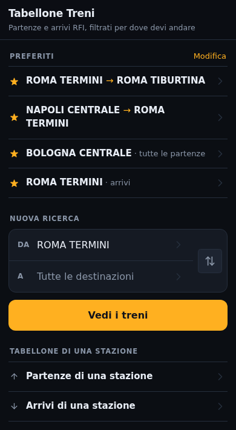
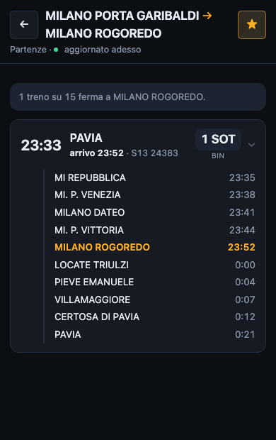
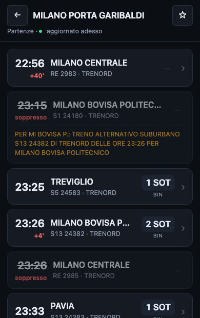
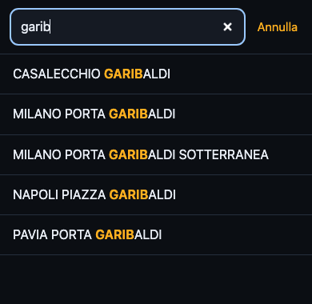

# Tabellone Treni

Una versione per telefono dei tabelloni di [RFI](https://iechub.rfi.it/ArriviPartenze),
con in più la cosa che al sito originale manca: **il filtro per dove devi
andare**. Scegli partenza e arrivo e vedi solo i treni che fermano davvero lì,
con l'orario a cui ci arrivano.

- si aggiorna da solo una volta al minuto, e si ferma quando la pagina non è in primo piano
- le tratte si salvano fra i preferiti e stanno in cima alla home
- installabile sulla schermata iniziale del telefono
- immagine Docker da 9 MB, nessun database, nessuno stato su disco

|  |  |
|:--|:--|
|  |  |
| **Le tratte salvate stanno in cima**, e si aprono con un tocco. | **Solo i treni che fermano dove vai**, con l'ora a cui ci arrivano. Toccando il treno si aprono le fermate, con la tua evidenziata. |
|  |  |
| **Il tabellone completo**, se ti serve tutto: ritardi, binari, soppressioni e avvisi. | **La ricerca** cerca dentro il nome, non solo all'inizio, e non tocca la rete. |

## Come funziona

Il tabellone di RFI è HTML renderizzato dal server: non esiste un endpoint JSON
e il suo JavaScript non fa nemmeno una chiamata di rete. Il server qui dentro lo
scarica, lo interpreta e ne serve i dati.

Il motivo per cui il server esiste sono due cose che il browser non può
aggirare: RFI non manda intestazioni CORS, e la sua pagina pesa circa 280 KB che
**non comprime nemmeno se gliela si chiede compressa**. Ridotta a dati e
gzippata, diventa ~3 KB per un tabellone intero e ~400 byte per uno filtrato.

Il filtro per destinazione costa una sola richiesta per aggiornamento, perché
ogni partenza porta già con sé l'elenco completo delle fermate successive.

I tabelloni stanno in cache 30 secondi, presi sotto un lock per stazione: dieci
persone sulla stessa stazione producono comunque una richiesta sola verso RFI
ogni mezzo minuto. Se RFI smette di rispondere, per un minuto viene servito il
tabellone scaduto invece di un errore.

### Il riconoscimento delle fermate

I nomi delle fermate sul tabellone sono abbreviati e non combaciano con quelli
del catalogo: `MI BOVISA P.` sta per `MILANO BOVISA POLITECNICO`. Si risolvono
su due livelli:

1. i **nomi brevi di ViaggiaTreno**, uniti al catalogo una volta sola quando lo
   si genera, che coprono le contrazioni (`BOLOGNA C.LE` → `BOLOGNA CENTRALE`);
2. un confronto **token per token, per prefisso**, che copre i troncamenti
   (`GAZZADA SCHIAN.M` → `GAZZADA SCHIANNO MORAZZONE`).

Il confronto richiede lo stesso numero di token da entrambe le parti. È questo
vincolo a impedire che `LODI` catturi `LODI VECCHIO`: un falso positivo qui
farebbe salire qualcuno sul treno sbagliato, quindi la regola resta stretta e le
eccezioni vere si aggiungono a mano in `cmd/genstations/main.go`.

## Farlo girare

```sh
docker run -p 8080:8080 ghcr.io/m4rc02u1f4a4/tabellonetreni:latest
```

oppure `docker compose up -d`. In sviluppo basta `go run .` — l'interfaccia è
HTML, CSS e JavaScript senza passo di build, quindi non serve Node.

| variabile | difetto | |
|---|---|---|
| `PORT` | `8080` | porta di ascolto |
| `ADDR` | `:8080` | indirizzo completo, ha la precedenza su `PORT` |

## Aggiornare il catalogo delle stazioni

Il catalogo (2435 stazioni con i loro alias) è committato in
`internal/stations/stations.json` ed embeddato nel binario: il server parte
istantaneamente e non dipende da due siti esterni per riuscire ad avviarsi.
Cambia molto di rado; per rigenerarlo:

```sh
go run ./cmd/genstations
```

## Limiti noti

- **Gli arrivi non si possono filtrare.** RFI pubblica le fermate successive
  solo sui tabelloni delle partenze. Chiedendo un filtro su un tabellone arrivi,
  l'app mostra tutti gli arrivi e lo dice.
- **Alcune stazioni non ci sono.** Il listino RFI non comprende la rete
  Ferrovienord (Saronno, Castellanza), quella svizzera oltre Chiasso, né
  impianti come Malpensa Aeroporto e Milano Bovisa Politecnico. Compaiono come
  fermate dei treni ma non sono selezionabili.
- **Il markup di RFI può cambiare senza preavviso.** I test girano su pagine
  reali salvate in `internal/rfi/testdata`: se si rompono senza che sia cambiato
  il codice, è cambiato il sito.

## Rilasci

Ogni commit su `main` fa una versione: `feat:` alza la minor, `fix:` e `perf:`
la patch, un `!` o un `BREAKING CHANGE:` la major, il resto vale patch. Il
workflow crea il tag (senza prefisso `v`), pubblica la release e spinge
l'immagine multi-architettura su GHCR.
